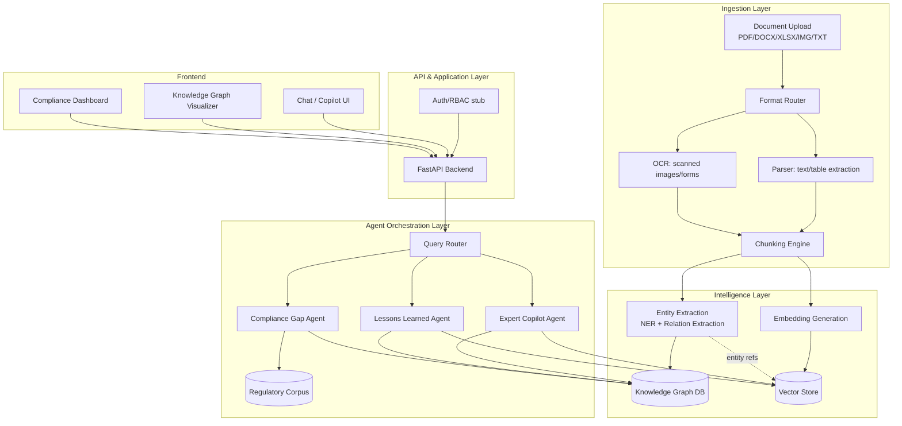

# architecture.md — OpsBrain System Architecture

**Version:** 1.0
**Companion to:** `PRD.md`

---

## 1. Architecture Principles

1. **Citations are first-class data, not an afterthought.** Every chunk stored carries provenance metadata that survives all the way to the final answer.
2. **Graph + Vector, not Graph or Vector.** Vector search finds semantically similar text; the knowledge graph finds *structurally* related facts a similarity score would miss (e.g., same equipment tag, different document, ten months apart).
3. **Agents are narrow and composable.** No single monolithic "do everything" agent — each agent has one job, one tool surface, and clear handoff contracts.
4. **Fail closed on confidence.** Low-confidence retrieval returns "insufficient evidence," never a best-guess hallucination.
5. **Designed to scale, demoed at hackathon size.** The demo corpus is ~20 documents; the architecture is built to point at 200,000 without a redesign — sharded vector store, queue-based ingestion, stateless API layer.

## 2. High-Level Architecture

## 3. Component Breakdown

### 3.1 Ingestion Layer
- **Format Router:** Detects file type, dispatches to correct parser.
- **Text/Table Parser:** For native PDFs, DOCX, XLSX/CSV — extracts text + tables preserving structure (row/column context retained as metadata, not flattened).
- **OCR Engine:** For scanned forms/images — extracts text with bounding-box coordinates so citations can point to the exact region.
- **Chunking Engine:** Semantic chunking (not fixed-length) — splits on section/heading boundaries where possible; each chunk tagged with `doc_id`, `page`, `section`, `source_type`.

### 3.2 Intelligence Layer
- **Entity Extraction (NER + Relation Extraction):** LLM-based extraction (few-shot prompted) pulling: equipment tags, personnel names, dates, regulatory clause IDs, procedure IDs, incident IDs. Relation extraction identifies edges: `MAINTAINED_BY`, `REFERENCED_IN`, `FAILED_ON`, `GOVERNED_BY`, `RESOLVED_BY`.
- **Knowledge Graph DB:** Stores entities as nodes, relations as edges. See schema in Section 6.
- **Embedding Generation:** Each chunk embedded and stored in the vector store with metadata linking back to its knowledge graph entities.
- **Vector Store:** Semantic similarity search over chunk embeddings, filterable by entity/document metadata.

### 3.3 Agent Orchestration Layer
- **Query Router:** Classifies incoming query intent (informational lookup / proactive-pattern check / compliance check) and routes to the appropriate agent.
- **Expert Copilot Agent:** RAG pipeline — retrieve (vector + graph traversal) → rerank → synthesize → cite.
- **Lessons Learned Agent:** Runs on new work-order/incident text; searches graph + vector store for structurally and semantically similar past incidents; pushes proactive alerts.
- **Compliance Gap Agent:** Retrieves relevant regulatory clauses (from a curated regulatory corpus) and diffs against ingested procedure text; flags missing or conflicting coverage.

### 3.4 API & Application Layer
- **FastAPI backend:** Stateless REST endpoints; all business logic in orchestration layer, API layer only routes/validates/auths.
- **Auth/RBAC stub:** Per-user document access tagging (demo: role-based, e.g., Technician / Engineer / Compliance / Manager).

### 3.5 Frontend
- **Chat/Copilot UI:** Mobile-first chat interface with inline citations.
- **Knowledge Graph Visualizer:** Interactive graph view (nodes = entities, edges = relations) for engineers exploring connections.
- **Compliance Dashboard:** Gap list with clause-vs-procedure side-by-side view.

## 4. End-to-End Data Flow (Ingestion → Answer)

1. Document uploaded → format detected → parsed/OCR'd → chunked.
2. Each chunk → entity extraction → nodes/edges written to knowledge graph.
3. Each chunk → embedded → stored in vector store with entity metadata cross-reference.
4. User query arrives → Query Router classifies intent.
5. Expert Copilot Agent: vector search retrieves candidate chunks → graph traversal expands to structurally linked entities (e.g., same equipment tag across other documents) → reranking → LLM synthesizes answer strictly from retrieved context → citations attached per claim → confidence score computed from retrieval score distribution.
6. Response returned with inline citations, rendered in UI with click-to-source links.

## 5. Tech Stack

| Layer | Technology (hackathon build) | Production equivalent |
|---|---|---|
| Backend API | FastAPI (Python) | Same, containerized |
| LLM | Claude API (Sonnet) via Anthropic API | Same, with prompt caching for cost |
| Embeddings | Open-source sentence-transformer or Voyage/OpenAI embeddings | Same, domain-tuned |
| Vector store | ChromaDB / FAISS (local) | Pinecone / Weaviate / pgvector at scale |
| Knowledge graph | NetworkX (in-memory) or Neo4j (if time allows) | Neo4j / Amazon Neptune |
| OCR | Tesseract / cloud OCR API | Cloud OCR (Textract/Document AI) |
| Frontend | React + Tailwind | Same |
| Queue (ingestion) | Simple async task queue (Python asyncio) | Celery/SQS-backed workers |
| Storage | Local filesystem / S3-compatible bucket | S3 + lifecycle policies |
| Auth | Stubbed roles | OAuth2/SSO, enterprise IdP integration |

## 6. Knowledge Graph Schema (core entities & relations)

**Node types:**
- `Equipment` (tag, type, location, install_date)
- `Document` (id, type, upload_date, source_system)
- `Person` (name, role)
- `Procedure` (id, title, version)
- `RegulatoryClause` (id, standard, clause_number)
- `Incident` / `NearMiss` (id, date, severity, description)
- `WorkOrder` (id, date, status)

**Edge types:**
- `Equipment -[MENTIONED_IN]-> Document`
- `Person -[AUTHORED]-> Document`
- `Person -[PERFORMED]-> WorkOrder`
- `WorkOrder -[TARGETS]-> Equipment`
- `Incident -[INVOLVES]-> Equipment`
- `Incident -[RESOLVED_BY]-> WorkOrder`
- `Procedure -[GOVERNED_BY]-> RegulatoryClause`
- `Procedure -[APPLIES_TO]-> Equipment`

This schema is what allows a query like *"has pump P-204 failed before"* to traverse `Equipment → Incident → WorkOrder → Document` even when no single document contains the full answer.

## 7. RAG Pipeline Detail

1. **Chunking strategy:** Section-aware, ~300–500 tokens per chunk, 15% overlap, metadata-tagged.
2. **Retrieval:** Hybrid — vector similarity (top-k=20) + graph-expansion (entities linked to query-matched entities, top-k=10) merged and deduplicated.
3. **Reranking:** Cross-encoder or LLM-based rerank of merged candidate set down to top 5–8 chunks.
4. **Synthesis:** LLM prompted with strict instruction: answer only from provided context; if context insufficient, say so explicitly; attach a citation marker to every factual sentence.
5. **Confidence scoring:** Derived from (a) retrieval similarity scores of chunks actually used, (b) number of independent sources agreeing, (c) recency of source documents.

## 8. Agent Orchestration & Guardrails

- Each agent has a **fixed tool surface** (e.g., Compliance Gap Agent can only read `RegulatoryClause` and `Procedure` nodes — it cannot write, and cannot access `Person` PII).
- Agents communicate through a shared **evidence object** (structured JSON: claim, source chunk IDs, confidence) — never free-text handoff, to keep provenance intact across agent boundaries.
- See `rules.md` for the full behavioral guardrail set (citation requirements, escalation thresholds, hallucination refusal).

## 9. Deployment Architecture

**Hackathon demo:** Single-host deployment — FastAPI + local vector store + in-memory graph, React frontend, all on one machine/cloud VM for live demo reliability.

**Production path (documented for judges, not built):**
- Ingestion workers horizontally scaled behind a queue (SQS/Kafka).
- Vector store sharded by plant/business-unit.
- Knowledge graph on managed graph DB with read replicas.
- API layer stateless, horizontally scaled behind a load balancer.
- Per-tenant document isolation for multi-plant deployments.

## 10. Security & Data Governance

- Document-level access control tagged at ingestion (role/plant/department).
- All agent outputs logged with query, retrieved sources, and response for audit trail (addresses FR-7 in PRD).
- PII (personnel names) access restricted to authorized roles; redaction option for shared/exported reports.
- No document content sent to third-party LLM providers beyond what's needed for the specific query context (no bulk corpus upload to external APIs).

## 11. Scalability Considerations

- Ingestion pipeline is embarrassingly parallel per-document — scales linearly with worker count.
- Vector store sharding by facility/business unit keeps query latency flat as corpus grows.
- Knowledge graph partitioning by plant avoids cross-tenant traversal cost.
- Reranking step is the main latency bottleneck at scale — cacheable for repeated/similar queries.
